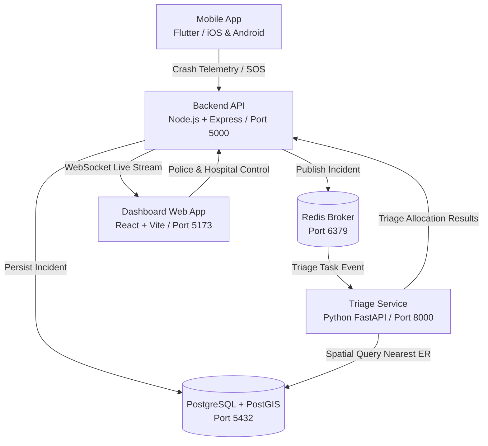

# Rakshak-AI System Architecture

"Rakshak-AI" is an emergency crash-detection, real-time alert dispatch, and hospital-triage system.

## System Components

1. **Mobile App (`/mobile`)**:
   - Built with **Flutter**.
   - Interfaces with accelerometer, gyroscope, and GPS sensors to detect potential high-impact vehicle collisions.
   - Triggers emergency countdown and transmits high-priority crash packets.

2. **Backend API (`/backend`)**:
   - Built with **Node.js, Express, and TypeScript**.
   - Handles authentication, telemetry ingestion, WebSocket connections for real-time dispatch, and CRUD endpoints.
   - Listens on port `5000`.

3. **Triage Service (`/triage-service`)**:
   - Built with **Python FastAPI**.
   - Executes spatial proximity queries (PostGIS), hospital bed capacity matching, severity scoring, and AI routing logic.
   - Listens on port `8000`.

4. **Dashboard (`/dashboard`)**:
   - Built with **React 18, TypeScript, and Vite**.
   - Dedicated interactive interfaces for Police control rooms and Hospital Trauma Centers.
   - Listens on port `5173`.

5. **Data Layer (`/db`)**:
   - **PostgreSQL 16 with PostGIS 3.4**: Spatial indexing of hospital locations, live ambulance tracking, and incident coordinates. Runs on port `5432`.
   - **Redis 7**: Fast pub/sub, real-time location caches, and rate limiting. Runs on port `6379`.
